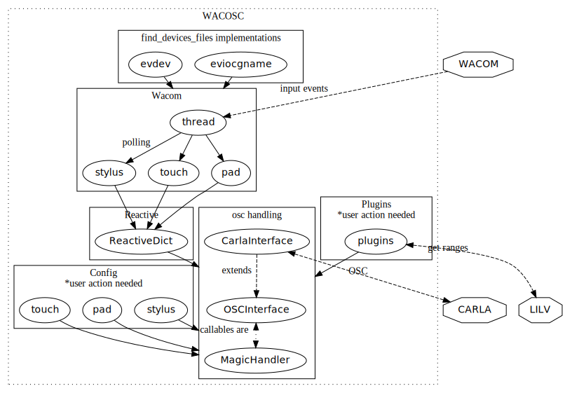

# WacOsc

Wacom to Open Sound Control

This project was made for the 19th GBE (Gara delle Batterie Elettroniche)

## Requirements

1. Linux

2. Carla

3. LV2 plugins

4. Python

5. liblo

6. lilv

7. root access

## Brief Description 

evdev is used to get the event devices for the pen, pad and finger events

Using `select`  we poll events on those files, unpack and handle them

Carla hosts the plugins and allows the parameters to be controlled.

But, we need to map them using pain python code.

So this project isn't indended to be used by "non-technical people"

And it is pretty limited in compatibility, at least currently.

The code itself is probably naive and hacked together

# Project Structure

### confusing? diagram!


## getting the devices mapping
### xinput.py

##### already deprecated, use evdev.py instead

code to identify the `/dev/eventXX` files

it has a function named `find_event_files` that allows you to get a dictionary that maps like this:

```
{
	"10": "Wacom Intuos Pro S Pad",
    "11": "Wacom Intuos Pro S Finger",
    "17": "Wacom Intuos Pro S Pen Pen (0x74800073)",
    "9": "Wacom Intuos Pro S Pen"
}
```

this module can also be called with `python -m wacosc.xinput` for detection debugging purposes.

I am keeping this module instead of deleting it, mecause someone might want to disable the mouse behaviour
while making music with wacosc. xinput is the way to do so, and you need the id

### evdev.py

##### use this only if you encouter issues with eviocgname.py

`pyton-evdev` dependency is needed to use this module.

my assumption about xinput ID == event ID was totally wrong.
evdev instead is the right way to gather information through the kernel.
```
{
    "/dev/input/event19": "Wacom Intuos Pro S Finger",
    "/dev/input/event18": "Wacom Intuos Pro S Pad",
    "/dev/input/event17": "Wacom Intuos Pro S Pen"
}
```
`# python -m wacosc.xinput`

### eviocgname.py

we list /dev/input devices and use `ioctl` to request the name directly from the hardware.

You can optionally install the `ioctl_opt` package to get actual input.h equivalents, for other informations, read the source code.

It is optional because I defined a constant value for eviocgname(1024)

`# python -m wacosc.eviocgname`

## wacom.py

code to poll the files in a separate thread.

this is the core of this project.

the actual core is the function `handle_wacom` that uses `select` to multiplex the events by their file descriptors
and calls the other `handle_*` functions defined in this module itself.

the `handle_*` functions are just setting the `stylus`, `pad` and `touch` objects's items
they are **reactive** objects and automagically call the **carla** osc methods...........

## reactive.py

a `ReactiveDict` is defined here

## tui.py

code to show/debug the inputs using `curses`

## carla.py

code to control carla lv2 plugins

we also use lilv to get all the lv2 plugins installed on the system, because carla currently doesn't expose the parameters list and the relative names and ranges
so for each plugin we get the parameters name, default, minimum and maxium value.

carla notifies through osc when plugins are added on the patchbay.

carla allow the parameter value to be set through osc, **but I wasn't able to find the mappings between parameter id and parameter name** in carla,
maybe [here](https://github.com/falkTX/Carla/blob/25c61989de0cfe55e4ff62af002403c9acaa1bd6/source/backend/engine/CarlaEngineOscSend.cpp) but i'm not sure.

[here's](https://github.com/falkTX/Carla/blob/25c61989de0cfe55e4ff62af002403c9acaa1bd6/source/backend/engine/CarlaEngineOscHandlers.cpp) instead the carla code that listens to our osc calls


#### to get that mapping

I open the plugin "edit" interface of carla and start couning them by 1
and I annotate them in `plugins.py` file

## plugins.py

code that uses lilv and dictionaries made as explained above (in `carla.py` explaination)

this module exposes `ranges` dictionary.

you can query by plugin name running like `# python -m wacosc.plugins "Noize Mak3r"`


# Special People

I acknoledge Rico, Magenta, Tab and a few others for supporting the idea and for giving or taking back motivation


# Installation

Install python, carla, lilv.

```bash
git clone https://framagit.org/castix/wacosc.git
cd wacosc
python -m venv --system-site-packages venv
. venv/bin/activate
pip install Cython
pip install -e ".[all]"
```

`--system-site-packages` is required in order to match the system-wide lilv bindings.

# my experiment environment

I run archlinux, with pipewire on a thinkpad x230.

I am using a wacom intuos pro S that Valentina sold to me for 75€ (in mint condition)

The wireless kit is not working so well, because the battery doesn't hold charge

## see it in action

### 2022-05-22 GBE

Let it happen
